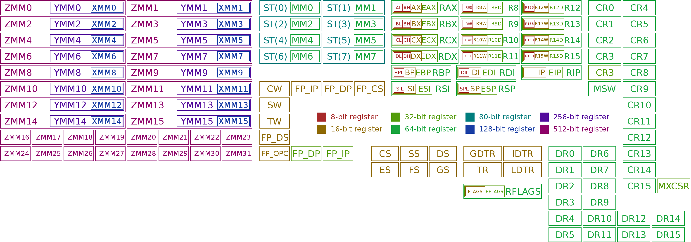

# x86 Assembly 

- This will try the best to teach you all about the x86 Assembly we will use in our way to create our own OS. I decided to do this because I counldn't find any good tutorial about this topic however I found some good sources for us to get started
- This is not really a language but more like a machine code which allows us to how more control but also more code to write and extremly hard to learn (if you know assembly, you are a GIGACHAD)

# x86 Assembly CPU
- Since assembly is so closely tied to the CPU we should know about how the CPU works properly
- If you decided to build your own OS, maybe you do know how it works. However, to be a reminder, CPU is the Central Processing Unit that follows a sequence of instructions to perform task by using binary

- When refering to **x86** we are talking about the x86-based processors and these processors have a features called "Registers"

**1. Register**
- They hold values during the computation but are not designed to hold data for a long period
- You can use it to save datas for calculation then load the result into other permanent memory location
- The x86 has some built in general purpose register as well as some special purpose *(8 General-Purpose Registers (GPR), 6 Segment Registers, 1 Flags Register and an Instruction Pointer. 64-bit x86 has additional registers)*
- The size is fixed with your machine (I have a 64 bits so I have a 64-bit registers) but backwards compatibility is maintained so we still can run 32 bit code so we still can run it in 64 bit



**NOTE**: To learn more about this, I would recommend you to check [this article about x86 CPU registers](https://wiki.osdev.org/CPU_Registers_x86) out

**2. Stack**
- This is an basic data structure, easy to understand so I'm not going to talk much about this. Just read [this article about stack](https://www.geeksforgeeks.org/stack-data-structure/)


# Assembly tutorial
**1. Environment setup**
- You should have the 'NASM' installed in your system
- To check if you already had it. Open terminal then ```whereis nasm```. Else install it using your package manager like apt, pacman, ... or download it manually
- To be easier to compile, you can use **Make**

**2. Basic syntax**
- An assembly can be devided into three main section
> The **data** section for declaring initialized data or constants
```
section.data
```
> The **bss** section for declaring variables
```
section.bss
```
> The **text** section for the actual code, it must begin with ```global _statrt``` to tell the kernel where the program execution begin!
```
section.text
   global _start
_start:
```

**3. Comment**
- In Assembly, a comment begins with a ```;``` and you can use inline comment
```
; This is a comment in Assembly!
```

```
mov eax, 1        ; This is also a comment!!!
```
- Unfortunately, this is not enough for us to print a "Hello world!" message